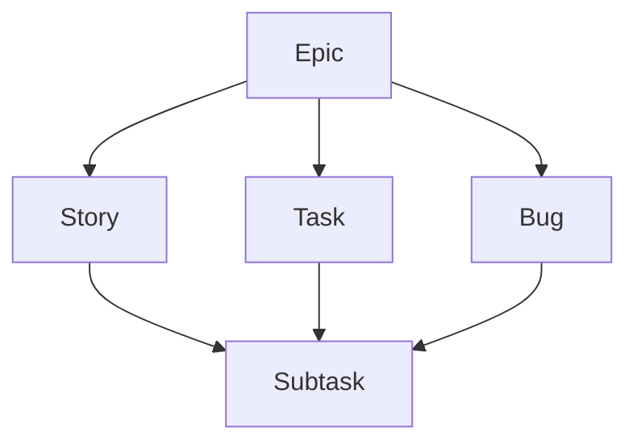

# Contributing

## Principles

We adapt the [DevIQ principles](https://deviq.com/principles/), applied with
judgment rather than dogma.

### Design

- **KISS**: Prefer the simplest solution that solves the problem at hand.
- **YAGNI**: Build for today's requirements, not for ones you expect to
  arrive.
- **DRY**: Give every piece of knowledge a single authoritative definition.
  Extract once duplication is real, not anticipated.

### Structure

- **Separation of Concerns**: Give each part one responsibility and a clear
  boundary.
- **SOLID**: Give each type one reason to change, extend it without modifying
  it, and depend on abstractions rather than implementations.
- **Explicit Dependencies**: Require collaborators openly in signatures
  rather than reaching for global or ambient state.

### Behavior

- **Principle of Least Astonishment**: Make code behave the way a reader
  expects, starting with names that state intent. Reserve comments for
  non-obvious reasoning.
- **Fail Fast**: Surface errors immediately and loudly instead of degrading
  silently.
- **Tell, Don't Ask**: Ask a collaborator to do the work rather than querying
  its state and deciding on its behalf.

### Maintenance

- **Boy Scout Rule**: Leave code cleaner than you found it.
- **Tolerance for Imperfection**: Accept good-enough code where the cost of
  perfecting it outweighs the benefit.
- **Architectural Agility**: Keep the architecture able to change as
  understanding of the problem grows.

---

## Architecture

We structure the repository as a monorepo of independently buildable units.

Within a module, we follow
[Vertical Slice Architecture](https://deviq.com/architecture/vertical-slice-architecture/):
draw boundaries by feature rather than technical layer, let each slice
organize its own internals, and, if it exposes anything, do so only through a
narrow public contract. Anything crossing a slice boundary goes through that
contract, never around it; shared code never depends on a slice.

---

## Documentation

We adapt the
[Google documentation guide](https://google.github.io/styleguide/docguide/) and
split documentation by audience:

- **README.md and docs/** (System-level): Project overview, how components
  connect, what infrastructure they run on, external dependencies. Nothing
  implementation-specific.
- **Module READMEs** (Implementation-level): Everything a developer needs to
  work on that part.

### 1. README files

We follow the
[Standard Readme](https://github.com/RichardLitt/standard-readme)
specification for README files.

- **Title**: The name, followed by a description of what it does.
- **Install**: Prerequisites, environment variables, and installation steps.
- **Usage**: Available runtime commands and interaction flows.
- **Development** (Modules only): Tech stack, directory tree, and code
  quality.
- **Deployment** (Modules only, if applicable): CI/CD pipelines, deployment
  targets, and hosting details.
- **Contributing**: A link to the contributing guidelines in
  `CONTRIBUTING.md`.
- **License**: A link to the legal license governing use.

### 2. docs/ARCHITECTURE.md

We follow the
[matklad ARCHITECTURE.md](https://matklad.github.io/2021/02/06/ARCHITECTURE.md.html)
approach. High-level system structure documentation.

- **Bird's Eye View**: High-level system diagram, infrastructure overview, and
  external boundaries.
- **Code Map**: Top-level directory tree, domain boundaries, and
  architectural invariants.
- **Cross-Cutting Concerns**: System-wide patterns and shared mechanics.

### 3. docs/API.md (if applicable)

We follow the [OpenAPI](https://swagger.io/specification/) specification.
Technical reference for external interfaces. Applies only if the project
exposes an API surface.

- **Version**: The current API version number, containing subsections for
  servers and available authorizations.
- **[Tags]**: Dedicated sections for each resource category, detailing each
  endpoint with parameters, request body, and responses.
- **Schemas**: Tabular definitions of request objects and response objects.

### 4. docs/DESIGN.md (if applicable)

We follow the
[Google DESIGN.md](https://github.com/google-labs-code/design.md)
specification. Standards for UI, UX, and visual identity. Applies only if the
project has a UI.

- **Frontmatter**: Machine-readable YAML design tokens.
- **Overview**: Brand summary, core visual style, and key user flows.
- **Colors**: Color palette definitions.
- **Typography**: Font families and sizing scales.
- **Layout**: Spacing and structural rules.
- **Elevation**: Guidelines for depth and shadows.
- **Shapes**: Rounded corners and geometric styles.
- **Components**: Definitions and diagrams for specific UI elements.
- **Do's and Don'ts**: Best practices for usage.

---

## Issues

We follow the
[Jira hierarchy](https://www.atlassian.com/software/jira/guides/issues/overview#what-is-an-work-item)
for issues.

### Issue Types

Each issue type has has a provided template.

| Type      | Purpose                   |
| :-------- | :------------------------ |
| `Epic`    | A high-level initiative   |
| `Story`   | A user-facing feature     |
| `Task`    | A technical piece of work |
| `Bug`     | A problem                 |
| `Subtask` | A granular piece of work  |

### Hierarchy



### Project Management

| View        | Purpose                                           |
| :---------- | :------------------------------------------------ |
| **Backlog** | A table for prioritizing stories, tasks, and bugs |
| **Board**   | A board for tracking stories, tasks, and bugs     |
| **Roadmap** | An overview of ongoing and upcoming epics         |

| Status        | Description                      |
| :------------ | :------------------------------- |
| `Todo`        | This item hasn't been started    |
| `In Progress` | This is actively being worked on |
| `Done`        | This has been completed          |

| Priority | Description               |
| :------- | :------------------------ |
| `Low`    | Non-urgent issues         |
| `Medium` | Standard priority issues  |
| `High`   | Critical or urgent issues |

### Issue Title

Issue titles follow the commit summary style but omit prefixes and use sentence
case. See [Commits](#commits) for details.

---

## Branches

We follow the [Conventional Branch](https://conventional-branch.github.io/)
specification.

### Branch Pattern

```text
<type>/[ticket-id]-<description>
```

### Branch Types

| Type       | Usage                |
| :--------- | :------------------- |
| `feature/` | New features         |
| `bugfix/`  | Bug fixes            |
| `hotfix/`  | Urgent fixes         |
| `release/` | Release preparations |
| `chore/`   | Maintenance tasks    |

### Branch Rules

- Lowercase only
- Hyphen-separated
- Concise descriptions

---

## Commits

We follow the
[Conventional Commits](https://www.conventionalcommits.org/en/v1.0.0)
specification.

### Commit Pattern

```text
<type>[optional scope][optional !]: <description>

[optional body]

[optional footer(s)]
```

### Commit Types

| Type       | Release | Description                 |
| :--------- | :------ | :-------------------------- |
| `fix`      | PATCH   | Bug fix                     |
| `feat`     | MINOR   | New feature                 |
| `build`    | -       | Build system changes        |
| `chore`    | -       | Maintenance / Tooling       |
| `ci`       | -       | CI configuration            |
| `docs`     | -       | Documentation               |
| `style`    | -       | Formatting (no code change) |
| `refactor` | -       | Code change (no feat/fix)   |
| `perf`     | -       | Performance improvement     |
| `test`     | -       | Adding/correcting tests     |
| `revert`   | -       | Reverts a previous commit   |

### Commit Rules

- **Imperative**: Use the imperative mood (e.g., `add` not `added`).
- **Formatting**: Lowercase start and no trailing period.
- **Breaking**: Append `!` to type/scope or include `BREAKING CHANGE:` footer
  for MAJOR version update.

---

## Pull Requests

We adapt the
[Gitmore PR](https://gitmore.io/blog/pull-request-template) template.

### PR Title

PR titles follow the commit summary style. See [Commits](#commits) for details.

### Description

Use the provided [template](PULL_REQUEST_TEMPLATE.md).
