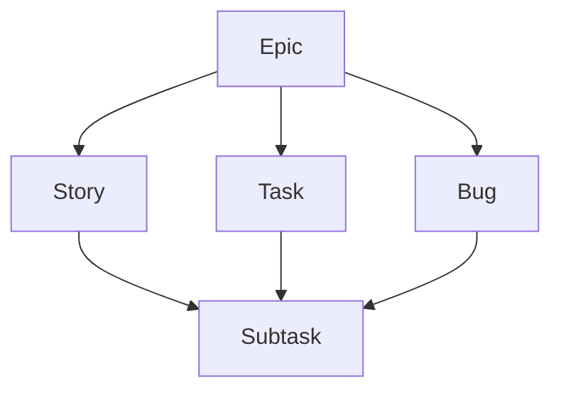

# Contributing

## Issues
We follow the [Jira hierarchy](https://www.atlassian.com/software/jira/guides/issues/overview#what-is-an-work-item) for issues. Choose the appropriate template:

| Type | Purpose |
| :--- | :--- |
| [`Epic`](.github/ISSUE_TEMPLATE/epic.yml) | A high-level initiative. |
| [`Story`](.github/ISSUE_TEMPLATE/story.yml) | A user-facing feature. |
| [`Task`](.github/ISSUE_TEMPLATE/task.yml) | A technical piece of work. |
| [`Bug`](.github/ISSUE_TEMPLATE/bug.yml) | A problem which impairs functionality. |
| [`Subtask`](.github/ISSUE_TEMPLATE/subtask.yml) | A granular piece of work. |

**Hierarchy Rules**:


**Project Management:**

| View | Purpose |
| :--- | :--- |
| [**Backlog**](https://github.com/users/aimarchirico/projects/1/views/1) | A table for prioritizing upcoming stories, tasks, and bugs. |
| [**Sprint Board**](https://github.com/users/aimarchirico/projects/1/views/2) | A board for tracking stories, tasks, and bugs in the active sprint. |

| Status | Description |
| :--- | :--- |
| `Todo` | Issues that are ready to be started. |
| `In Progress` | Issues currently being addressed. |
| `Done` | Issues that are completed. |

| Priority | Description |
| :--- | :--- |
| `High` | Critical or urgent issues. |
| `Medium` | Standard priority issues. |
| `Low` | Non-urgent issues. |

**Naming Rules**:
Issue summaries are based on the [Conventional Commits](https://www.conventionalcommits.org/en/v1.0.0/) imperative style, and follow these formatting rules:
- **Imperative**: Use the imperative mood (e.g., `Add` not `Added`).
- **Capitalized**: Start the first word with a capital letter.
- **Clean**: No prefixes (e.g., `feat:`, `fix:`) or trailing periods.

---

## Branching
We follow the [Conventional Branch](https://conventional-branch.github.io/) specification.

**Title**: `<type>/[issue-id]-<description>`

| Type | Usage |
| :--- | :--- |
| `feature/` | New features |
| `bugfix/` | Bug fixes |
| `hotfix/` | Urgent fixes |
| `release/` | Release preparations |
| `chore/` | Maintenance tasks |

**Rules**:
- Lowercase only
- Hyphen-separated
- Concise descriptions

---

## Commits
We follow the [Conventional Commits](https://www.conventionalcommits.org/en/v1.0.0) specification.

**Pattern**:
```text
<type>[optional scope][optional !]: <description>

[optional body]

[optional footer(s)]
```

| Type | Release | Description |
| :--- | :--- | :--- |
| `fix` | PATCH | Bug fix |
| `feat` | MINOR | New feature |
| `build` | - | Build system changes |
| `chore` | - | Maintenance / Tooling |
| `ci` | - | CI configuration |
| `docs` | - | Documentation |
| `style` | - | Formatting (no code change) |
| `refactor`| - | Code change (no feat/fix) |
| `perf` | - | Performance improvement |
| `test` | - | Adding/correcting tests |
| `revert` | - | Reverts a previous commit |

**Rules**:
- **Breaking**: Append `!` to type/scope or use `BREAKING CHANGE:` footer.
- **Mood**: Use imperative (e.g., `add` not `added`).
- **Format**: Lowercase start, no trailing period.

---

## Pull Requests
We follow the [Conventional Commits](https://www.conventionalcommits.org/en/v1.0.0) specification for PR titles.

**Title**: `<type>[optional scope][optional !]: <description>`

**Description**: Use the provided [template](.github/PULL_REQUEST_TEMPLATE.md).